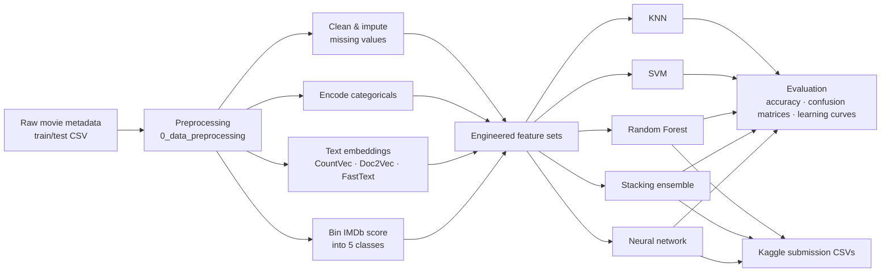
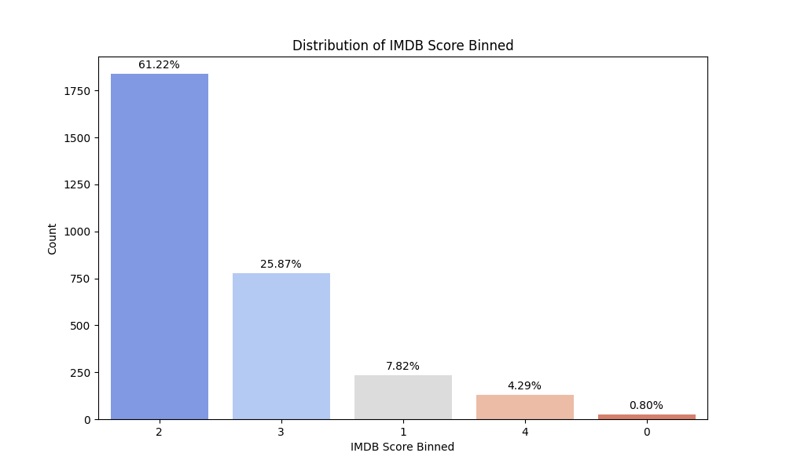
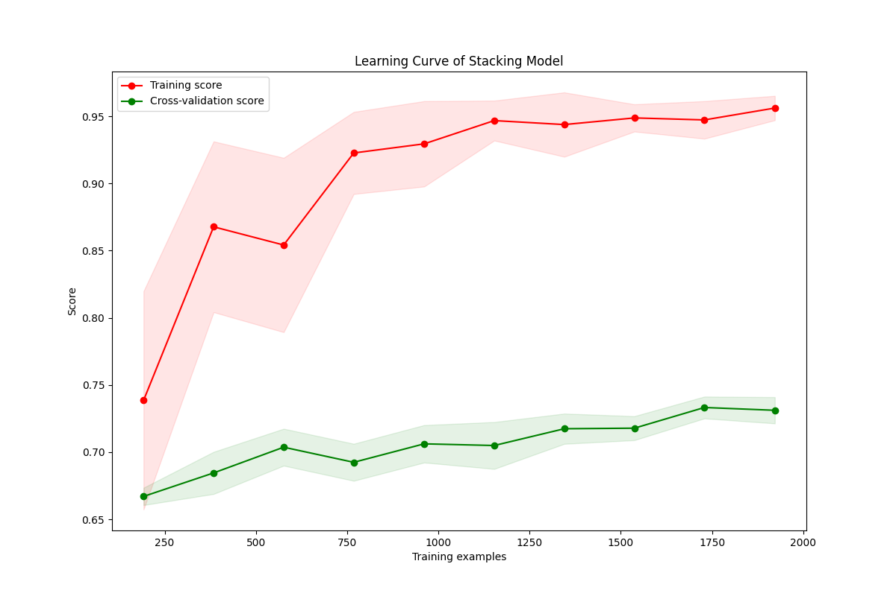
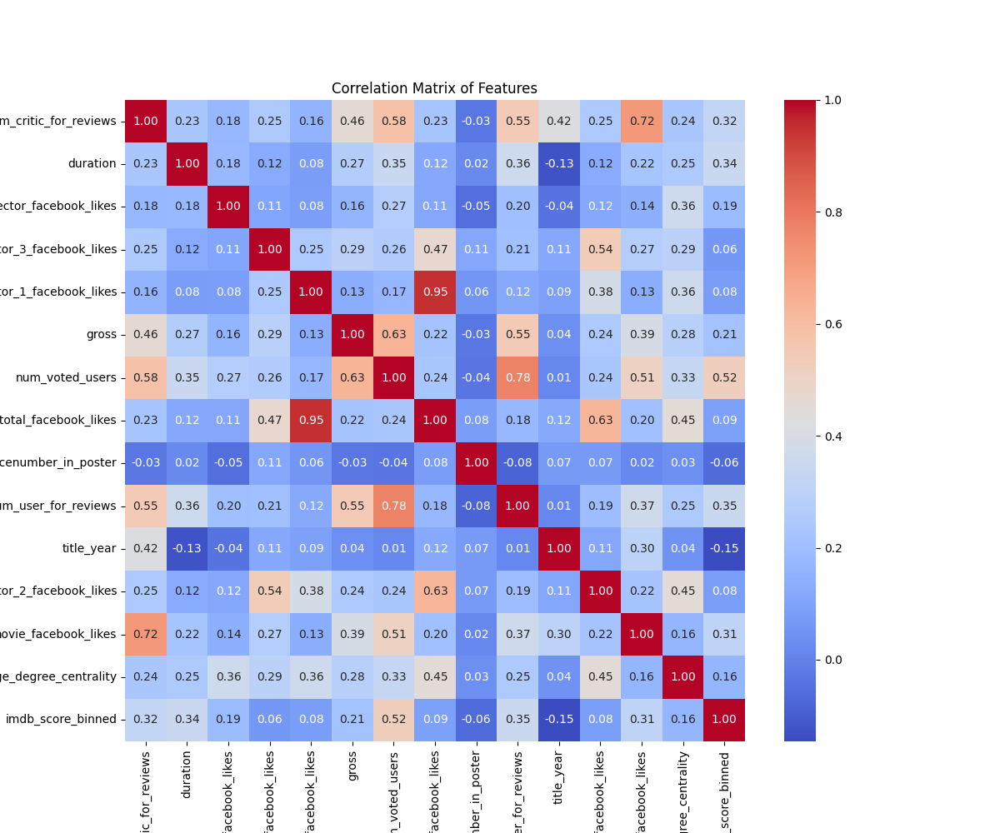

# 🎬 IMDB Movie Rating Predictor

Predict a movie's IMDb rating band from its metadata — cast and crew popularity,
genres, plot keywords, box-office figures, and learned text embeddings. The
project benchmarks five classification approaches (KNN, SVM, Random Forest, a
stacking ensemble, and a neural network) on the same engineered feature set and
compares them against a majority-class baseline.

The best model — a feed-forward neural network — reaches **73.4%** accuracy on
held-out data for a **5-class, heavily imbalanced** problem where simply guessing
the most common class scores **61.2%**.

---

## ✨ Key features

- **End-to-end pipeline** — one notebook (`src/run_all_models.ipynb`) runs
  preprocessing and every model in order, fully reproducible.
- **Rich feature engineering** — numeric metadata, categorical encodings, and
  text turned into vectors via **CountVectorizer**, **Doc2Vec**, and **FastText**.
- **Five model families benchmarked** head-to-head on identical splits with a
  fixed random seed for reproducibility.
- **Honest evaluation** — every model is measured against a majority-class
  baseline, with confusion matrices and learning curves to expose class
  imbalance and over/under-fitting.
- **Kaggle-ready outputs** — prediction CSVs for the competition test set in
  `Kaggle_submissions/`.

---

## 🧰 Tech stack

| Area | Tools |
|------|-------|
| Language | Python 3.11 |
| Data wrangling | pandas, NumPy, SciPy |
| Classical ML | scikit-learn (KNN, SVM, Random Forest, stacking) |
| Deep learning | TensorFlow / Keras |
| Text embeddings | CountVectorizer, Doc2Vec, FastText |
| Visualization | Matplotlib, seaborn |
| Environment | Jupyter Notebook |

---

## 🏗️ Architecture / data flow



---

## 📊 Results

The target `imdb_score_binned` has **5 classes** and is strongly imbalanced —
one class accounts for ~61% of all movies. The majority-class baseline is
therefore a demanding sanity check.



Held-out accuracy by model:

| Model | Accuracy | vs. baseline |
|-------|---------:|:------------:|
| Majority-class baseline | 61.2% | — |
| SVM | 61.1% | ≈ baseline |
| K-Nearest Neighbours (standardized) | 66.4% | ▲ |
| Random Forest (selected features) | 70.2% | ▲▲ |
| Stacking (Decision Tree + Logistic Regression + Random Forest) | 70.5% | ▲▲ |
| **Neural network** | **73.4%** | **▲▲▲** |

**Takeaways**
- The **neural network** is the strongest model, with the stacking ensemble and
  Random Forest close behind.
- **SVM barely beats the majority baseline** — on this imbalanced, mostly
  metadata-driven feature set it adds little over guessing the dominant class.
- Feature selection meaningfully helped the Random Forest (≈64% → 70%),
  trimming noisy high-dimensional text features.

Stacking-model learning curve (train vs. validation):



Feature correlation overview:



All generated figures (per-model confusion matrices, additional learning curves,
exploratory plots) live in [`graphs/`](graphs/).

---

## 🚀 Getting started

### Prerequisites
- Python 3.11
- ~1 GB free disk (datasets and pre-computed feature matrices are included)

### Setup

```bash
# 1. Clone
git clone https://github.com/unsf5294/imdb-rating-predictor.git
cd imdb-rating-predictor

# 2. Create and activate a virtual environment
python -m venv .venv
# Windows:  .venv\Scripts\activate
# macOS/Linux:  source .venv/bin/activate

# 3. Install dependencies
pip install -r requirements.txt

# 4. Launch Jupyter
jupyter notebook
```

### Run everything

Open [`src/run_all_models.ipynb`](src/run_all_models.ipynb) and **Run All**. It
executes preprocessing followed by each model notebook in sequence and
regenerates the figures in `graphs/`.

To explore a single model, open its notebook directly (e.g.
[`src/3_random_forest.ipynb`](src/3_random_forest.ipynb)).

---

## 📁 Project structure

```
imdb-rating-predictor/
├── src/                          # Notebooks
│   ├── run_all_models.ipynb      # Orchestrator — runs the full pipeline
│   ├── 0_data_preprocessing.ipynb
│   ├── 1_K-NN_classifier.ipynb
│   ├── 2_SVM.ipynb
│   ├── 3_random_forest.ipynb
│   ├── 4_stacking_model.ipynb
│   └── 5_neural_networks.ipynb
├── data/                         # Datasets + pre-computed feature matrices
│   ├── train_dataset.csv         # 3,004 labeled instances
│   ├── test_dataset.csv          # 752 unlabeled instances
│   ├── features_countvec/        # CountVectorizer features (.npy)
│   ├── features_doc2vec/         # Doc2Vec features (.npy)
│   ├── features_fasttext/        # FastText title embeddings (.npy)
│   └── Readme.txt                # Dataset/column documentation
├── graphs/                       # Generated figures
├── Kaggle_submissions/           # Prediction CSVs for the test set
├── requirements.txt
├── LICENSE
└── README.md
```

---

## 📝 Notes on authorship

This started as a two-person academic machine-learning project; I (the repository
owner) authored the large majority of the code. The full commit history is
preserved as-is, so every contributor's commits remain intact and credited.

## 📄 License

Released under the [MIT License](LICENSE).

## 🙏 Acknowledgements

Built on the publicly available
[IMDb 5000 Movie Dataset](https://www.kaggle.com/datasets/carolzhangdc/imdb-5000-movie-dataset)
(modified). See [`data/Readme.txt`](data/Readme.txt) for full column
descriptions and feature-engineering details.
